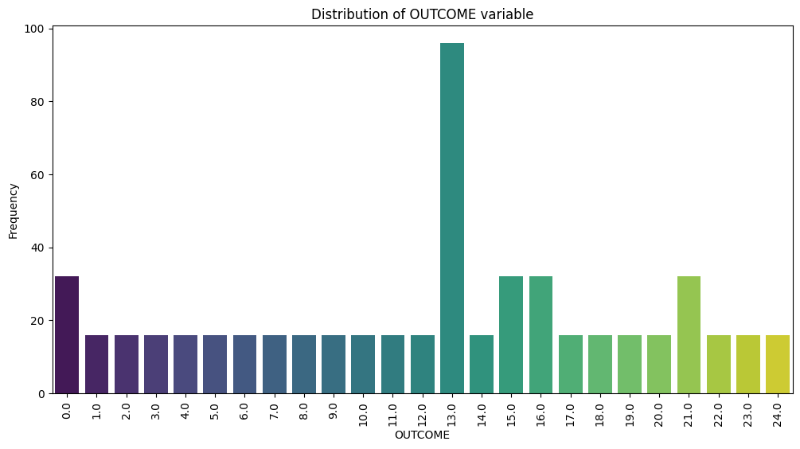
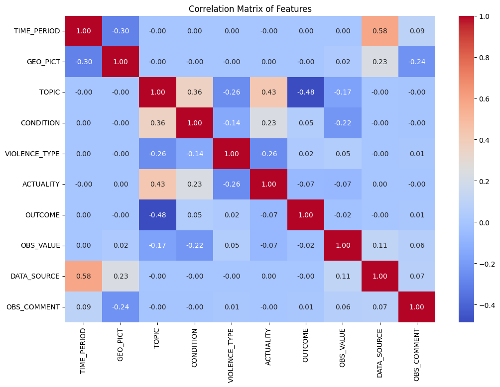
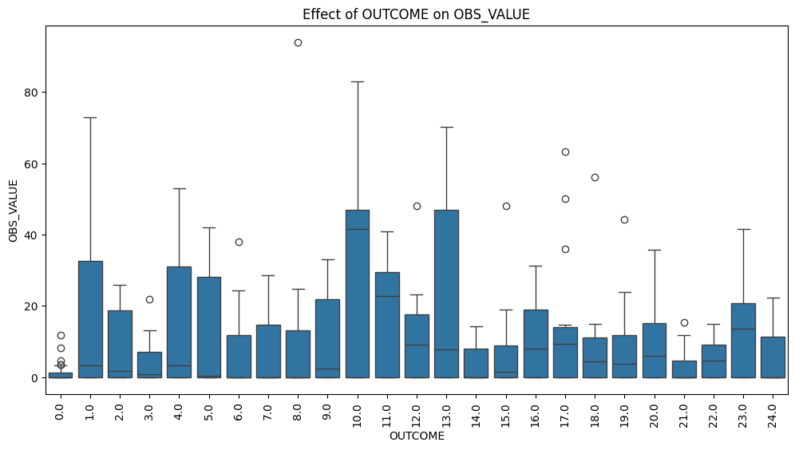
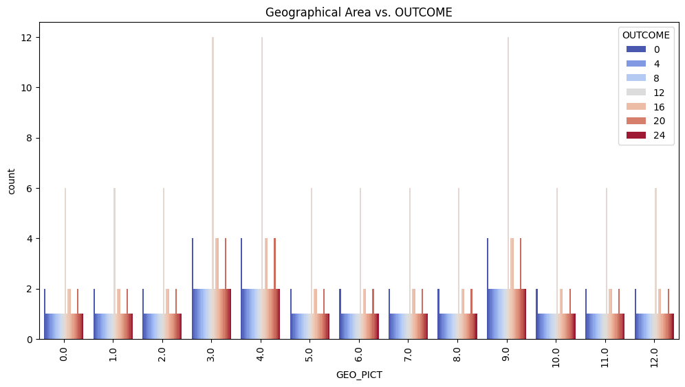
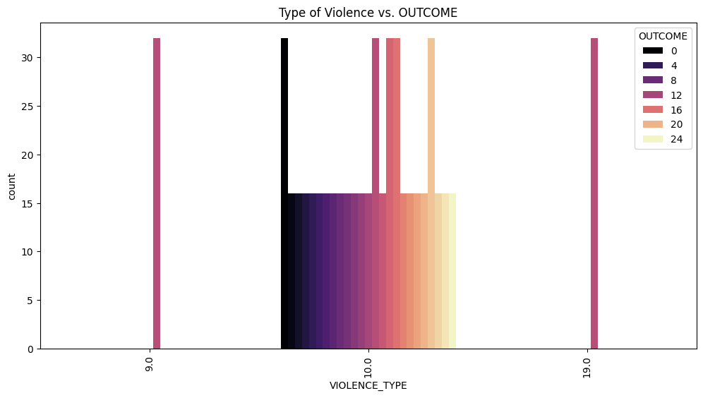

# Results & Findings from Data Analysis
## VAW Project - Data Insights

## Dataset Overview
The dataset consists of **544 labeled observations** with multiple categorical and numerical features, related to violence incidents and their outcomes. The primary target variable is **OUTCOME**, which represents different consequences experienced by victims.

## Key Findings

### 1. Outcome Distribution
The **OUTCOME variable** is highly **imbalanced**, with certain categories significantly more frequent than others.

- **Category 13** has the highest occurrence (**96 instances**).
- Many other categories have only **16 instances each**, which can negatively impact model performance.
- **Resampling techniques (e.g., SMOTE) or weighted classification approaches** might be needed.

---

### 2. Correlation Analysis
Most features show **weak correlations** with OUTCOME.

- **TOPIC** has the highest negative correlation (**-0.48**) with OUTCOME, suggesting a potential link between different topics and the severity of outcomes.
- **CONDITION and VIOLENCE_TYPE** show **small positive correlations**.
- **No categorical feature passed the Chi² significance test**, meaning no **strong statistical dependence** was found between categorical features and OUTCOME.

---

### 3. Effect of OBS_VALUE on OUTCOME
- The **OBS_VALUE feature**, which likely represents severity or frequency, varies significantly across different OUTCOME categories.
- **Some categories have extreme outliers**, indicating exceptional cases.
- The variation in OBS_VALUE suggests that it **could be an important predictor** for modeling.

---

### 4. Geographical Impact on OUTCOME
- Different geographical areas (**GEO_PICT**) show **variations in OUTCOME distribution**.
- Some regions have **higher representation in severe outcome categories**, while others show a more even distribution.
- These insights could guide policy recommendations on **regional interventions** for violence prevention.

---

### 5. Type of Violence vs. OUTCOME
- Certain types of violence (**VIOLENCE_TYPE**) are **strongly associated with specific OUTCOME categories**.
- The visualization suggests **distinct patterns**, meaning different forms of violence lead to different victim consequences.
- Further investigation could help in **targeting support programs**.

---

## Conclusion & Next Steps
Based on these findings, the dataset exhibits **class imbalance** and weak overall correlations with OUTCOME, but some **important patterns emerge** related to **geographical distribution, severity (OBS_VALUE), and type of violence**.

### Future Actions:
- **Addressing class imbalance** using oversampling techniques (e.g., SMOTE) or weighted classifiers.
- Conducting **feature engineering** to extract more meaningful insights.
- Exploring **dimensionality reduction (PCA, t-SNE)** to find latent patterns in the data.
- Investigating **clustering techniques** to uncover hidden relationships.

---

